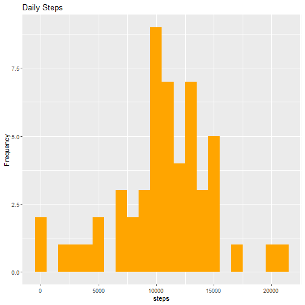
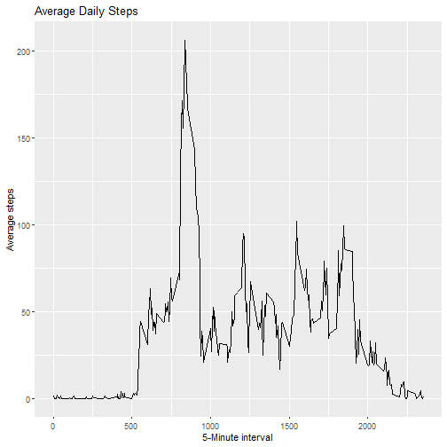
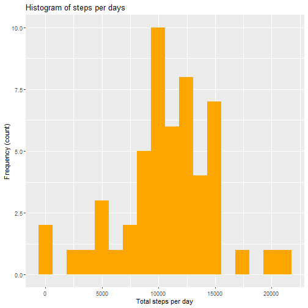
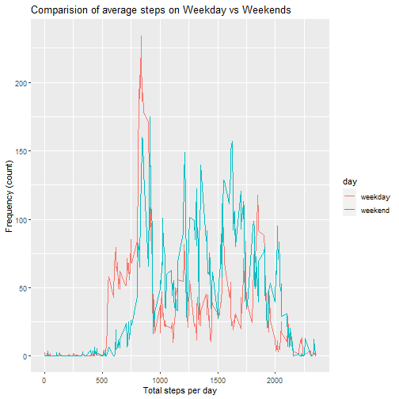

##Introduction
==================
It is now possible to collect a large amount of data about personal movement using activity monitoring devices such as a Fitbit, Nike Fuelband, or Jawbone Up. These type of devices are part of the “quantified self” movement – a group of enthusiasts who take measurements about themselves regularly to improve their health, to find patterns in their behavior, or because they are tech geeks. But these data remain under-utilized both because the raw data are hard to obtain and there is a lack of statistical methods and software for processing and interpreting the data.

##Data
==================
This assignment makes use of data from a personal activity monitoring device. This device collects data at 5 minute intervals through out the day. The data consists of two months of data from an anonymous individual collected during the months of October and November, 2012 and include the number of steps taken in 5 minute intervals each day.

The data for this assignment can be downloaded from the course web site:

Dataset: Activity monitoring data [here](https://d396qusza40orc.cloudfront.net/repdata%2Fdata%2Factivity.zip) ]

The variables included in this dataset are:

* steps: Number of steps taking in a 5-minute interval (missing values are coded as NA) 
* date: The date on which the measurement was taken in YYYY-MM-DD format
* interval: Identifier for the 5-minute interval in which measurement was taken

The dataset is stored in a comma-separated-value (CSV) file and there are a total of 17,568 observations in this dataset.

### 1. Code for reading in the dataset and/or processing the data

```r
library(dplyr)
library(ggplot2)
library(knitr)
```


```r
activity <- read.csv("activity.csv")
```


### 2. Histogram of the total number of steps taken each day

```r
#Cacluate total number of steps
steps_tot <- group_by(activity[complete.cases(activity), ], date) %>% 
  summarise(total = sum(steps, na.rm = T))

head(steps_tot)
```

```
## # A tibble: 6 x 2
##   date       total
##   <chr>      <int>
## 1 2012-10-02   126
## 2 2012-10-03 11352
## 3 2012-10-04 12116
## 4 2012-10-05 13294
## 5 2012-10-06 15420
## 6 2012-10-07 11015
```

```r
#Plot histogram
ggplot(steps_tot, aes(x = total)) +
  geom_histogram(fill = "orange", binwidth = 1000) +
  labs(title = "Daily Steps", x = "steps", y = "Frequency")
```




### 3. Mean and median number of steps taken each day

```r
#Cacluate mean and median number of steps
mean_steps <- mean(steps_tot$total)
cat("The mean steps are:", mean_steps)
```

```
## The mean steps are: 10766.19
```

```r
median_steps <- median(steps_tot$total)
cat("The median_steps are:", median_steps)
```

```
## The median_steps are: 10765
```

### 4. Time series plot of the average number of steps taken

```r
mean_steps_1 <- group_by(activity, interval) %>% 
  summarise(mean = mean(steps, na.rm = T))

ggplot(mean_steps_1, aes(x = interval, y = mean)) +
  geom_line() +
  labs(title = "Average Daily Steps", x = "5-Minute interval", y = "Average steps")
```



### 5. The 5-minute interval that, on average, contains the maximum number of steps

```r
int <- mean_steps_1[which.max(mean_steps_1$mean), ]$interval
max1 <- mean_steps_1[which.max(mean_steps_1$mean), ]$mean  

cat("The ", int, "contains the average max number of steps of:", max1)
```

```
## The  835 contains the average max number of steps of: 206.1698
```


### 6. Code to describe and show a strategy for imputing missing data

```r
sum(is.na(activity$steps))
```

```
## [1] 2304
```

```r
sum(is.na(activity$date))
```

```
## [1] 0
```

```r
sum(is.na(activity$interval))
```

```
## [1] 0
```

```r
tot_na <- sum(is.na(activity$steps)) + sum(is.na(activity$date)) + sum(is.na(activity$interval))

        
cat("There are", tot_na, "missing values in the data set") 
```

```
## There are 2304 missing values in the data set
```

```r
#Remove the na values 
activity_new <- na.omit(activity)
```


### 7. Histogram of the total number of steps taken each day after missing values are imputed

```r
activity_new_hist <- group_by(activity_new, date) %>% summarise(total = sum(steps))

ggplot(activity_new_hist, aes(x = total)) +
  geom_histogram(bins = 18, fill = "orange") + 
  labs(title = "Histogram of steps per days", x = "Total steps per day", y = "Frequency (count)")
```



### 8. Panel plot comparing the average number of steps taken per 5-minute interval across weekdays and weekends

```r
#Add column of week and weekend day
activity_weekdays <- activity_new
activity_weekdays$day <- ifelse(as.POSIXlt(activity_weekdays$date)$wday %in% c(1:5), 'weekday', 'weekend')

activity_weekdays_mean <- activity_weekdays %>% group_by(day, interval) %>% summarise(meanSteps = mean(steps))
```

```
## `summarise()` has grouped output by 'day'. You can override using the `.groups` argument.
```

```r
#Plot graph
ggplot(activity_weekdays_mean, aes(x = interval, y = meanSteps, color = `day`)) +
  geom_line() + # facet_grid(day ~.) + #indicates row numbers == number of variables in the day col
  labs(title = "Comparision of average steps on Weekday vs Weekends", 
       x = "Total steps per day",
       y = "Frequency (count)")
```




